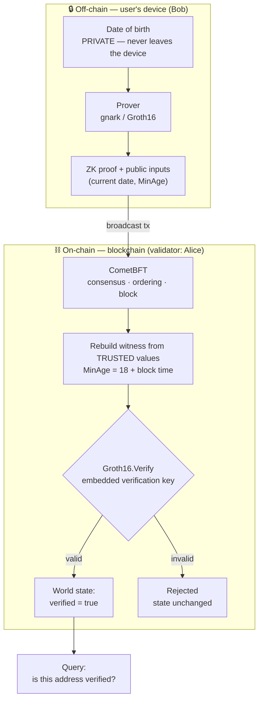

# How it works — data flow

**Read it left to right:**

1. The **date of birth stays in the left box** — only the proof crosses the trust boundary.
2. **CometBFT** orders the transaction and puts it in a block (consensus).
3. The chain **rebuilds the public inputs itself** from trusted values — this is the security fix.
4. **Groth16.Verify** runs inside the state machine; valid → stored, invalid → rejected.
5. Anyone can **query** the result; the birth date was never revealed.
